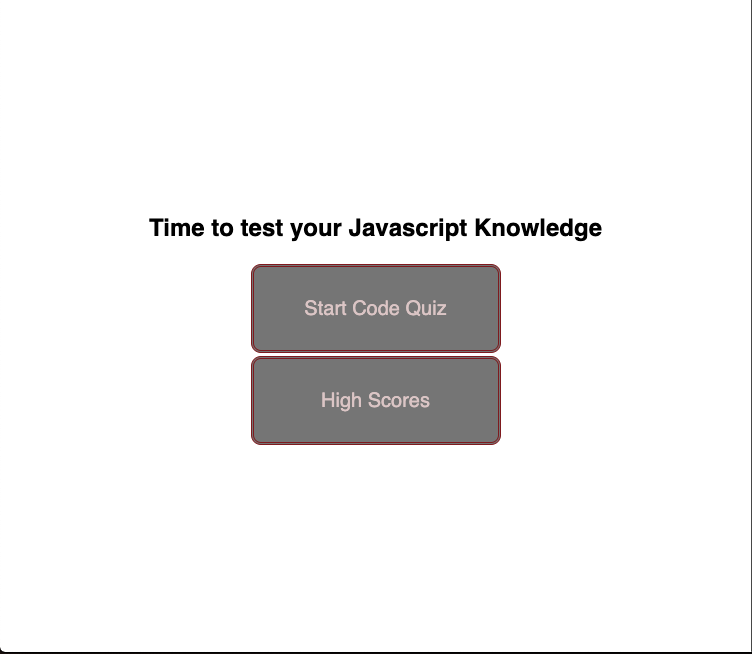

# Code-Quiz-AK

## Description 
This is a timmed quiz on Javascript fundamentals that stores high scores. Once you click "Start Quiz" the app will time you for six mutiple chioce question. 
When you are done you may enter your name to be listed in among the high scores. 
On the starter page and after you finish the quiz there is a highscores button that will also show you and other participants high scores. 
You can clear the scores if you wish or play the quiz again. 

## Web Link
Visit deplyed project at:

